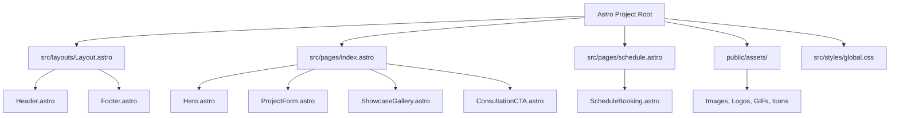

# Implementation Plan: Outdoor Lighting & Audio Astro Website

Build a state-of-the-art, high-performance **Astro** website replicating the **Outdoor Lighting & Audio** landing page (`/outdoor-lighting-audio/`) and the **Consultation & Schedule** page (`/schedule/`) for PROJECT:automate, with all media assets downloaded locally.

---

## Proposed Architecture & Component Design

---

## User Review Required

> [!NOTE]
> All media assets from `https://projectautomate.com/outdoor-lighting-audio/` and `https://projectautomate.com/schedule/` will be downloaded into `public/assets/` so the website runs 100% offline and standalone without hotlinking external WordPress servers.

> [!IMPORTANT]
> The interactive Project Request Form (MetForm) will be implemented as a modern, reactive component with custom select pills/dropdowns, field validation, formatted phone inputs, and instant user feedback. The `/schedule` page will feature the responsive Cal.com booking widget and concierge contact options.

---

## Proposed Changes

### Media & Assets Layer

#### [NEW] `scripts/download_assets.ps1`
- Script to fetch all 12+ images, logos, animated hover GIFs, and icons into `public/assets/images/` and `public/assets/icons/`.

---

### Project Configuration & Foundation

#### [NEW] `package.json`
- Astro 5.x setup with scripts (`dev`, `build`, `preview`).

#### [NEW] `astro.config.mjs`
- Standard Astro configuration.

#### [NEW] `src/styles/global.css`
- Luxury dark theme design system tokens:
  - Deep blacks (`#050505`, `#0d0d0d`), surface cards (`#141414`), borders (`rgba(255, 255, 255, 0.08)`).
  - Typography (`Century Gothic`, `Outfit`, `Helvetica Neue`, `sans-serif`).
  - Micro-animations, glowing hover states, custom scrollbars, responsive layouts.

---

### Layouts & Components

#### [NEW] `src/layouts/Layout.astro`
- HTML5 shell with Open Graph tags, SEO metadata, preloaded fonts, and favicon.

#### [NEW] `src/components/Header.astro`
- Interactive logo with hover animation switch (`PROJECT_automate_Logo` -> `output-onlinegiftools.gif`).
- Desktop & Mobile Off-Canvas / Fullscreen navigation drawer.
- Menu items with dynamic hover image preview (*Core Services*, *About Us*, *Design Partner*, *Blogs*, *Contact Us*).
- Submenu accordion for *Core Services*.
- "Schedule Consultation" CTA button.

#### [NEW] `src/components/Hero.astro`
- Luxury dark hero section with glowing ambiance.
- H1: *"Your Home Shouldn't End at the Back Door."*
- H2: *"Architectural landscape lighting and high-performance outdoor audio designed as one seamless outdoor experience."*
- CTA button scrolling smoothly to `#quote-form` or linking to `/schedule`.

#### [NEW] `src/components/ProjectForm.astro`
- Embedded Project Request Form matching Section 2:
  - Title: *"Tell Us About Your Outdoor Project"*
  - Description: *"Every property is different. Share a few details about what you are planning and our team will review your project before reaching out."*
  - Interactive multi-selects:
    1. Interest (*Landscape Lighting*, *Outdoor Audio*, *Both*)
    2. Timeline (*Immediately*, *Within 1 month*, *1–6 months*, *Just exploring*)
    3. Budget Range (*$10K–$25K*, *$25K–$50K*, *$50K–$100K*, *$100K+*)
  - Inputs: ZIP Code, First Name, Last Name, Phone Number (US formatted), Email.
  - SMS Consent and Terms & Privacy checkboxes.
  - Interactive submission validation with success confirmation modal.

#### [NEW] `src/components/ShowcaseGallery.astro`
- Feature Showcase matching Section 3:
  - H2: *"Designed for Life After Sunset."*
  - Description: *"Your landscaping, architecture and outdoor spaces were designed to be experienced, not disappear when the sun goes down."*
  - Location badge: *1600 Rosecrans Ave, Building 7, Suite 400 Manhattan Beach, CA 90266*
  - 5 high-resolution architectural gallery cards with hover zoom and lightbox effect.

#### [NEW] `src/components/ConsultationCTA.astro`
- Private Consultation booking card matching Section 4:
  - H2: *"Prefer to Speak With Us Directly?"*
  - Body text detailing private property consultation.
  - Bullet highlights (*Choose a time that works for you*).
  - CTA Button: *"Book a Private Consultation Now"* (links to `/schedule`).

#### [NEW] `src/components/Footer.astro`
- Complete footer matching the client website:
  - Brand tagline: *"The art of invisible intelligence. Custom smart home systems for the world's most refined residences."*
  - Concierge details (Phone: `(310) 740-5375` / `(310) 402-4818`, Email: `sales@projectautomate.com`, Manhattan Beach CA address).
  - Quick Links & 8 Services lists.
  - Consultation prompt & Copyright.

---

### Pages

#### [NEW] `src/pages/index.astro`
- Main Outdoor Lighting & Audio landing page (`/` or `/outdoor-lighting-audio`).

#### [NEW] `src/pages/schedule.astro`
- Dedicated Consultation & Booking page (`/schedule`):
  - H1: *"Schedule Your Consultation"*
  - Subtitle: *"Tell us about your project and choose a time that works for you..."*
  - Cal.com responsive inline booking scheduler integration.
  - Direct concierge phone & email contact cards.

---

## Verification Plan

### Automated Build Verification
- Execute `npm.cmd run build` to ensure all Astro pages compile cleanly to static HTML/CSS/JS without any errors.

### Manual & Interactive Verification
- Verify that all local images, icons, and animated logos render smoothly.
- Test the responsive layout on desktop, tablet, and mobile breakpoints.
- Test interactive states: logo hover animation, navigation drawer image previews, multi-select form pills, form validation, and Cal.com scheduler embed.
